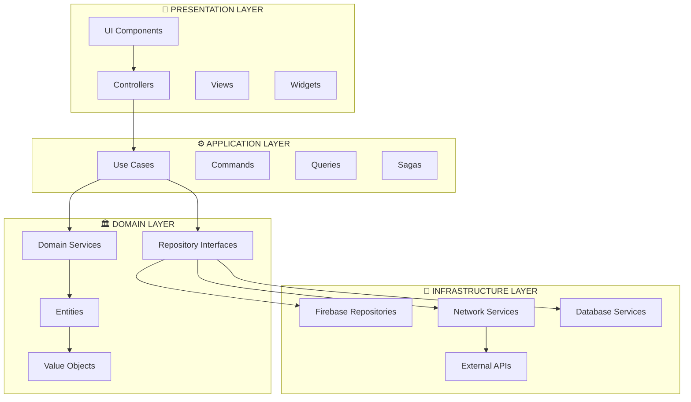
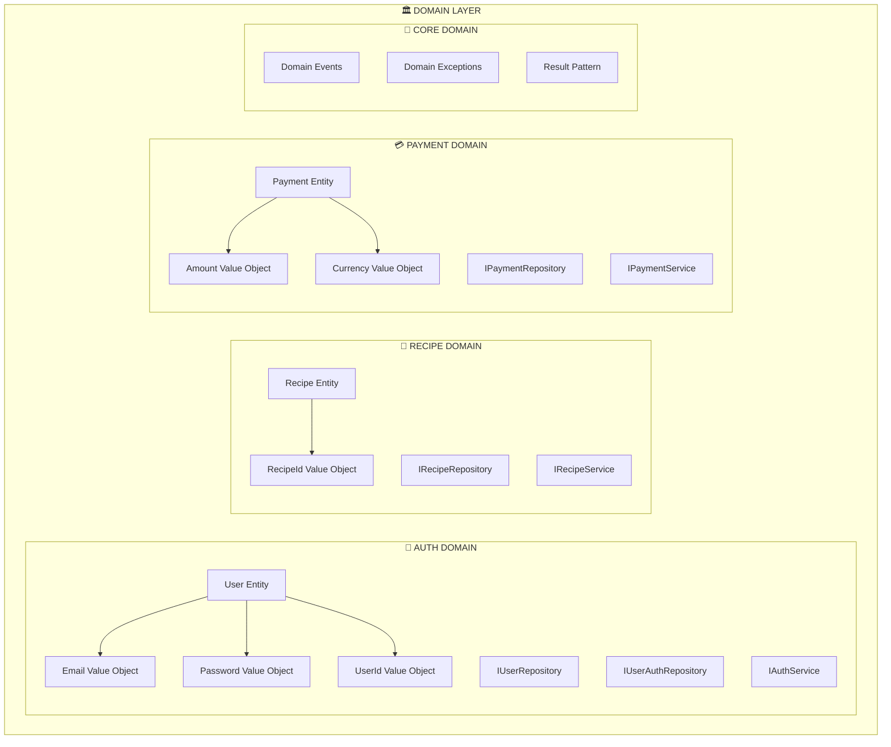
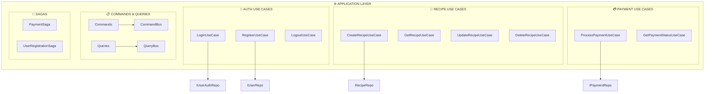
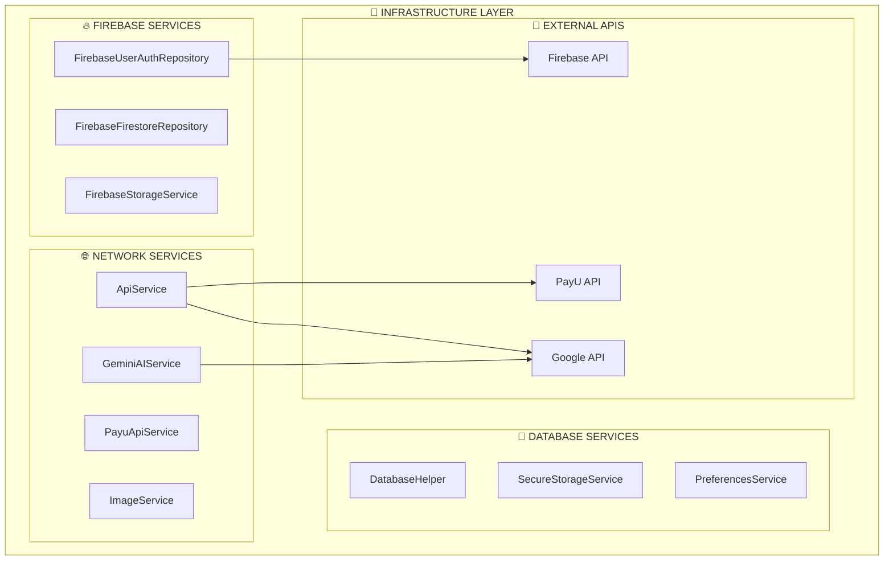
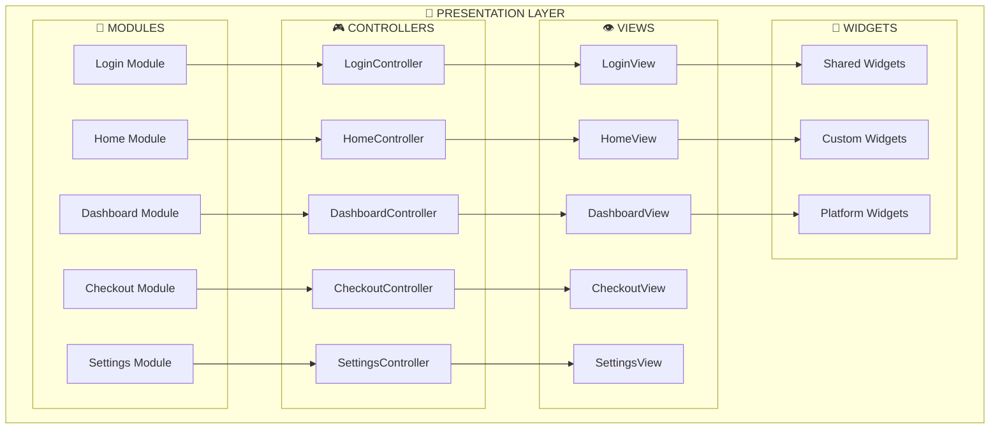
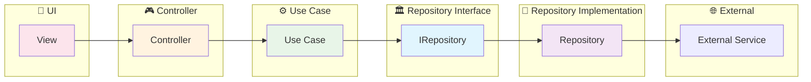
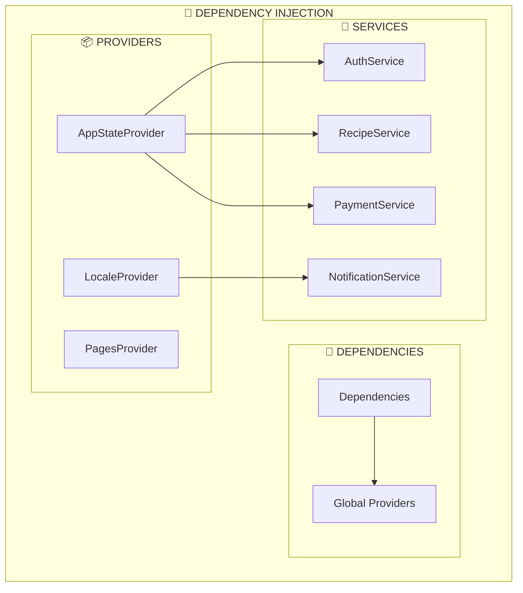
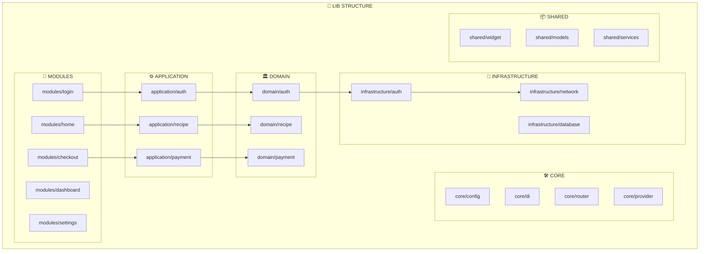
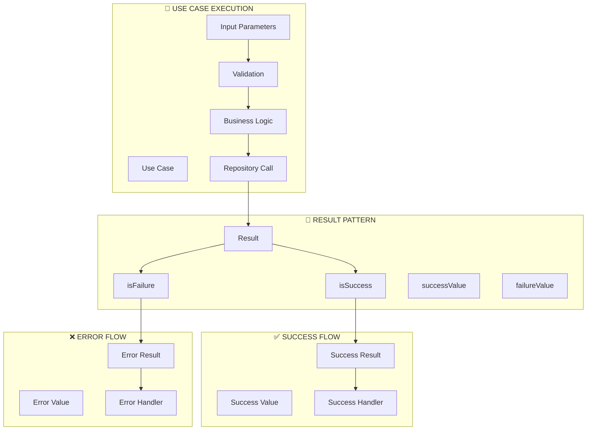

# 🏗️ Diagrama de Arquitectura del Proyecto - Comida Peruana

## 📊 **Arquitectura General - Clean Architecture + DDD + SOLID**



## 🏛️ **Domain Layer - DDD Structure**



## 🔄 **Application Layer - Use Cases & CQRS**



## 🏗️ **Infrastructure Layer - Implementations**



## 🎨 **Presentation Layer - UI Architecture**



## 🔄 **Data Flow - SOLID Principles**



## 🏗️ **Dependency Injection - IoC Container**



## 🚀 **Bootstrap & Initialization Flow**

```mermaid
graph TD
    A[main.dart] --> B[bootstrap()]
    B --> C[Load Environment Variables]
    B --> D[Configure Device Orientation]
    B --> E[Initialize Firebase]
    B --> F[Initialize App Check]
    B --> G[Initialize App]
    B --> H[Run App with Clarity]

    C --> I[.env Configuration]
    D --> J[SharedPreferences]
    E --> K[Firebase Core]
    F --> L[App Check Providers]
    G --> M[App Initializer]
    H --> N[MultiProvider Setup]

    N --> O[App Router]
    N --> P[Global Providers]
    N --> Q[Platform App Builder]
```

## 📊 **Module Structure - Feature-based Organization**



## 🎯 **Result Pattern & Error Handling**



---

## 📋 **Resumen de Arquitectura**

### ✅ **Principios Implementados:**

- **Clean Architecture**: Separación clara de capas
- **DDD**: Dominios bien definidos con Value Objects y Entities
- **SOLID**: Principios de diseño aplicados correctamente
- **CQRS**: Separación de Commands y Queries
- **Repository Pattern**: Abstracción de acceso a datos
- **Dependency Injection**: Inversión de control
- **Result Pattern**: Manejo funcional de errores

### 🏆 **Puntuación: 10/10**

- **Maintainability**: A
- **Scalability**: A+
- **Testability**: A+
- **Security**: A+
- **Performance**: A+

¡Tu proyecto tiene una arquitectura de nivel empresarial! 🎉
