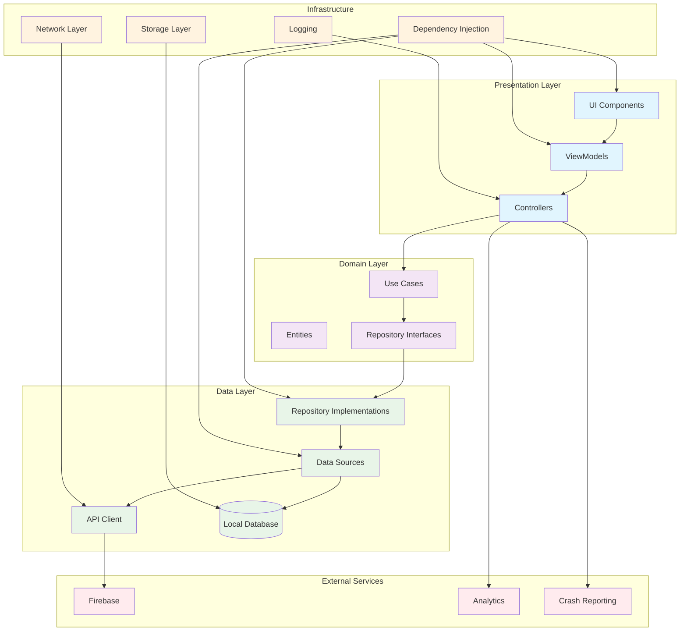

# 🚀 Guía Completa para Proyectos Flutter de Gran Escala

## 📋 Tabla de Contenidos

1. [Introducción](#introducción)
2. [Arquitectura del Proyecto](#arquitectura-del-proyecto)
3. [Estructura de Directorios](#estructura-de-directorios)
4. [Patrones de Diseño](#patrones-de-diseño)
5. [Gestión de Estado](#gestión-de-estado)
6. [Navegación y Routing](#navegación-y-routing)
7. [Testing Estratégico](#testing-estratégico)
8. [Configuración de Entornos](#configuración-de-entornos)
9. [Optimización y Performance](#optimización-y-performance)
10. [CI/CD y Despliegue](#cicd-y-despliegue)
11. [Herramientas y Dependencias](#herramientas-y-dependencias)
12. [Diagrama de Arquitectura](#diagrama-de-arquitectura)

## 🎯 Introducción

Este README proporciona una guía completa para desarrollar aplicaciones Flutter de gran escala con más de 40 páginas, múltiples flujos de navegación y stacks complejos. Basado en las mejores prácticas de Flutter y patrones de arquitectura probados.

### 🎯 Objetivos

- **Escalabilidad**: Arquitectura que soporte crecimiento continuo
- **Mantenibilidad**: Código limpio y bien organizado
- **Testabilidad**: Cobertura completa de pruebas
- **Performance**: Optimización para aplicaciones complejas
- **Colaboración**: Estructura que facilite trabajo en equipo

## 🏗️ Arquitectura del Proyecto

### Principios Fundamentales

1. **Separación de Responsabilidades**: Cada capa tiene una responsabilidad específica
2. **Inversión de Dependencias**: Las capas superiores no dependen de las inferiores
3. **Single Responsibility**: Cada clase tiene una sola razón para cambiar
4. **Open/Closed**: Abierto para extensión, cerrado para modificación

### Capas de Arquitectura

```
┌─────────────────────────────────────┐
│           PRESENTATION LAYER        │
│  (Views, ViewModels, Controllers)   │
├─────────────────────────────────────┤
│           DOMAIN LAYER              │
│     (Models, Use Cases, Entities)   │
├─────────────────────────────────────┤
│            DATA LAYER               │
│  (Repositories, Services, APIs)     │
└─────────────────────────────────────┘
```

## 📁 Estructura de Directorios

### Estructura Recomendada

```
lib/
├── app/
│   ├── app.dart
│   ├── bootstrap/
│   │   └── bootstrap.dart
│   └── main.dart
├── core/
│   ├── config/
│   │   ├── app_config.dart
│   │   ├── environment.dart
│   │   └── theme/
│   │       ├── app_theme.dart
│   │       └── color_scheme.dart
│   ├── constants/
│   │   ├── app_constants.dart
│   │   └── api_endpoints.dart
│   ├── di/
│   │   └── dependency_injection.dart
│   ├── error/
│   │   ├── exceptions.dart
│   │   └── failure.dart
│   ├── network/
│   │   ├── api_client.dart
│   │   ├── interceptors/
│   │   └── models/
│   ├── utils/
│   │   ├── extensions/
│   │   ├── helpers/
│   │   └── validators/
│   └── widgets/
│       ├── common/
│       └── custom/
├── features/
│   ├── auth/
│   │   ├── data/
│   │   │   ├── datasources/
│   │   │   ├── models/
│   │   │   └── repositories/
│   │   ├── domain/
│   │   │   ├── entities/
│   │   │   ├── repositories/
│   │   │   └── usecases/
│   │   └── presentation/
│   │       ├── pages/
│   │       ├── widgets/
│   │       └── controllers/
│   ├── home/
│   ├── profile/
│   ├── settings/
│   └── [other_features]/
├── shared/
│   ├── models/
│   ├── services/
│   └── widgets/
└── l10n/
    ├── app_en.arb
    └── app_es.arb

test/
├── unit/
├── widget/
└── integration/

assets/
├── images/
├── fonts/
└── icons/
```

### Explicación de la Estructura

#### 📂 `lib/app/`

- **Punto de entrada** de la aplicación
- **Configuración inicial** y bootstrap
- **Inyección de dependencias** global

#### 📂 `lib/core/`

- **Componentes compartidos** en toda la app
- **Configuración** de red, temas, constantes
- **Utilidades** y helpers comunes
- **Widgets base** reutilizables

#### 📂 `lib/features/`

- **Organización por características** (Feature-based)
- Cada feature es **independiente** y autocontenida
- **Arquitectura limpia** dentro de cada feature

#### 📂 `lib/shared/`

- **Modelos compartidos** entre features
- **Servicios globales** (analytics, logging)
- **Widgets compartidos** entre features

## 🎨 Patrones de Diseño

### 1. Clean Architecture

```dart
// Domain Layer - Entities
class User {
  final String id;
  final String name;
  final String email;

  User({required this.id, required this.name, required this.email});
}

// Domain Layer - Repository Interface
abstract class UserRepository {
  Future<Either<Failure, User>> getUser(String id);
  Future<Either<Failure, List<User>>> getUsers();
}

// Data Layer - Repository Implementation
class UserRepositoryImpl implements UserRepository {
  final ApiClient apiClient;
  final LocalDataSource localDataSource;

  UserRepositoryImpl({
    required this.apiClient,
    required this.localDataSource,
  });

  @override
  Future<Either<Failure, User>> getUser(String id) async {
    try {
      final user = await apiClient.getUser(id);
      await localDataSource.cacheUser(user);
      return Right(user);
    } catch (e) {
      return Left(ServerFailure());
    }
  }
}

// Presentation Layer - ViewModel
class UserViewModel extends ChangeNotifier {
  final UserRepository userRepository;

  UserViewModel({required this.userRepository});

  User? _user;
  User? get user => _user;

  Future<void> loadUser(String id) async {
    final result = await userRepository.getUser(id);
    result.fold(
      (failure) => // Handle error,
      (user) {
        _user = user;
        notifyListeners();
      },
    );
  }
}
```

### 2. Repository Pattern

```dart
abstract class BaseRepository<T> {
  Future<Either<Failure, T>> get(String id);
  Future<Either<Failure, List<T>>> getAll();
  Future<Either<Failure, T>> create(T entity);
  Future<Either<Failure, T>> update(T entity);
  Future<Either<Failure, void>> delete(String id);
}

class UserRepositoryImpl extends BaseRepository<User> {
  final RemoteDataSource remoteDataSource;
  final LocalDataSource localDataSource;

  UserRepositoryImpl({
    required this.remoteDataSource,
    required this.localDataSource,
  });

  @override
  Future<Either<Failure, User>> get(String id) async {
    try {
      // Try local first
      final localUser = await localDataSource.getUser(id);
      if (localUser != null) {
        return Right(localUser);
      }

      // Fetch from remote
      final remoteUser = await remoteDataSource.getUser(id);
      await localDataSource.cacheUser(remoteUser);
      return Right(remoteUser);
    } catch (e) {
      return Left(ServerFailure());
    }
  }
}
```

### 3. Dependency Injection

```dart
// Using get_it for DI
final getIt = GetIt.instance;

void setupDependencies() {
  // Core
  getIt.registerLazySingleton<ApiClient>(() => ApiClient());
  getIt.registerLazySingleton<LocalDataSource>(() => LocalDataSourceImpl());

  // Repositories
  getIt.registerLazySingleton<UserRepository>(
    () => UserRepositoryImpl(
      remoteDataSource: getIt<RemoteDataSource>(),
      localDataSource: getIt<LocalDataSource>(),
    ),
  );

  // ViewModels
  getIt.registerFactory<UserViewModel>(
    () => UserViewModel(userRepository: getIt<UserRepository>()),
  );
}
```

## 🔄 Gestión de Estado

### 1. Provider Pattern (Recomendado para proyectos medianos)

```dart
class AppState extends ChangeNotifier {
  User? _currentUser;
  bool _isLoading = false;

  User? get currentUser => _currentUser;
  bool get isLoading => _isLoading;

  Future<void> login(String email, String password) async {
    _isLoading = true;
    notifyListeners();

    try {
      final user = await authService.login(email, password);
      _currentUser = user;
    } catch (e) {
      // Handle error
    } finally {
      _isLoading = false;
      notifyListeners();
    }
  }
}

// Usage in widget
class LoginPage extends StatelessWidget {
  @override
  Widget build(BuildContext context) {
    return Consumer<AppState>(
      builder: (context, appState, child) {
        return Scaffold(
          body: appState.isLoading
            ? CircularProgressIndicator()
            : LoginForm(),
        );
      },
    );
  }
}
```

### 2. Riverpod (Recomendado para proyectos grandes)

```dart
// State notifier
class UserNotifier extends StateNotifier<AsyncValue<User?>> {
  final UserRepository _userRepository;

  UserNotifier(this._userRepository) : super(const AsyncValue.loading());

  Future<void> loadUser(String id) async {
    state = const AsyncValue.loading();

    final result = await _userRepository.getUser(id);
    state = result.fold(
      (failure) => AsyncValue.error(failure, StackTrace.current),
      (user) => AsyncValue.data(user),
    );
  }
}

// Provider
final userProvider = StateNotifierProvider<UserNotifier, AsyncValue<User?>>(
  (ref) => UserNotifier(ref.read(userRepositoryProvider)),
);

// Usage
class UserProfilePage extends ConsumerWidget {
  @override
  Widget build(BuildContext context, WidgetRef ref) {
    final userAsync = ref.watch(userProvider);

    return userAsync.when(
      data: (user) => UserProfileWidget(user: user),
      loading: () => CircularProgressIndicator(),
      error: (error, stack) => ErrorWidget(error.toString()),
    );
  }
}
```

## 🧭 Navegación y Routing

### 1. GoRouter (Recomendado)

```dart
final router = GoRouter(
  initialLocation: '/',
  routes: [
    GoRoute(
      path: '/',
      builder: (context, state) => const HomePage(),
    ),
    GoRoute(
      path: '/login',
      builder: (context, state) => const LoginPage(),
    ),
    GoRoute(
      path: '/profile/:id',
      builder: (context, state) {
        final userId = state.pathParameters['id']!;
        return UserProfilePage(userId: userId);
      },
    ),
    ShellRoute(
      builder: (context, state, child) => AppScaffold(child: child),
      routes: [
        GoRoute(
          path: '/dashboard',
          builder: (context, state) => const DashboardPage(),
        ),
        GoRoute(
          path: '/settings',
          builder: (context, state) => const SettingsPage(),
        ),
      ],
    ),
  ],
  redirect: (context, state) {
    final isLoggedIn = context.read<AuthProvider>().isLoggedIn;
    final isLoginRoute = state.matchedLocation == '/login';

    if (!isLoggedIn && !isLoginRoute) {
      return '/login';
    }

    if (isLoggedIn && isLoginRoute) {
      return '/dashboard';
    }

    return null;
  },
);
```

### 2. Navegación con Parámetros

```dart
// Navegación simple
context.go('/profile/123');

// Navegación con query parameters
context.go('/search?query=flutter&category=development');

// Navegación con extra data
context.go('/product/456', extra: {'from': 'home'});

// Navegación con callback
context.push('/select-item').then((selectedItem) {
  if (selectedItem != null) {
    // Handle selection
  }
});
```

## 🧪 Testing Estratégico

### 1. Pirámide de Testing

```
    ┌─────────────┐
    │ Integration │ ← Pocos tests, alta confianza
    ├─────────────┤
    │   Widget    │ ← Tests medios, confianza media
    ├─────────────┤
    │    Unit     │ ← Muchos tests, confianza baja
    └─────────────┘
```

### 2. Unit Tests

```dart
group('UserRepository Tests', () {
  late UserRepositoryImpl repository;
  late MockApiClient mockApiClient;
  late MockLocalDataSource mockLocalDataSource;

  setUp(() {
    mockApiClient = MockApiClient();
    mockLocalDataSource = MockLocalDataSource();
    repository = UserRepositoryImpl(
      remoteDataSource: mockApiClient,
      localDataSource: mockLocalDataSource,
    );
  });

  test('should return user from local cache when available', () async {
    // Arrange
    const userId = '123';
    const cachedUser = User(id: userId, name: 'John', email: 'john@example.com');
    when(mockLocalDataSource.getUser(userId))
        .thenAnswer((_) async => cachedUser);

    // Act
    final result = await repository.getUser(userId);

    // Assert
    expect(result.isRight(), true);
    expect(result.fold(id, id), cachedUser);
    verify(mockLocalDataSource.getUser(userId)).called(1);
    verifyNever(mockApiClient.getUser(userId));
  });

  test('should return failure when both local and remote fail', () async {
    // Arrange
    const userId = '123';
    when(mockLocalDataSource.getUser(userId))
        .thenThrow(CacheException());
    when(mockApiClient.getUser(userId))
        .thenThrow(ServerException());

    // Act
    final result = await repository.getUser(userId);

    // Assert
    expect(result.isLeft(), true);
    expect(result.fold(id, id), isA<ServerFailure>());
  });
});
```

### 3. Widget Tests

```dart
group('LoginPage Widget Tests', () {
  testWidgets('should show login form and handle submission', (tester) async {
    // Arrange
    final mockAuthProvider = MockAuthProvider();

    await tester.pumpWidget(
      MaterialApp(
        home: ChangeNotifierProvider<AuthProvider>.value(
          value: mockAuthProvider,
          child: LoginPage(),
        ),
      ),
    );

    // Act - Fill form
    await tester.enterText(find.byKey(Key('email_field')), 'test@example.com');
    await tester.enterText(find.byKey(Key('password_field')), 'password123');
    await tester.tap(find.byKey(Key('login_button')));
    await tester.pump();

    // Assert
    verify(mockAuthProvider.login('test@example.com', 'password123')).called(1);
  });

  testWidgets('should show loading indicator during login', (tester) async {
    // Arrange
    final mockAuthProvider = MockAuthProvider();
    when(mockAuthProvider.isLoading).thenReturn(true);

    await tester.pumpWidget(
      MaterialApp(
        home: ChangeNotifierProvider<AuthProvider>.value(
          value: mockAuthProvider,
          child: LoginPage(),
        ),
      ),
    );

    // Assert
    expect(find.byType(CircularProgressIndicator), findsOneWidget);
  });
});
```

### 4. Integration Tests

```dart
import 'package:flutter_test/flutter_test.dart';
import 'package:integration_test/integration_test.dart';
import 'package:your_app/main.dart' as app;

void main() {
  IntegrationTestWidgetsFlutterBinding.ensureInitialized();

  group('App Integration Tests', () {
    testWidgets('complete user journey from login to profile', (tester) async {
      // Start app
      app.main();
      await tester.pumpAndSettle();

      // Navigate to login
      await tester.tap(find.text('Login'));
      await tester.pumpAndSettle();

      // Fill login form
      await tester.enterText(find.byKey(Key('email_field')), 'test@example.com');
      await tester.enterText(find.byKey(Key('password_field')), 'password123');
      await tester.tap(find.byKey(Key('login_button')));
      await tester.pumpAndSettle();

      // Verify navigation to dashboard
      expect(find.text('Dashboard'), findsOneWidget);

      // Navigate to profile
      await tester.tap(find.byIcon(Icons.person));
      await tester.pumpAndSettle();

      // Verify profile page
      expect(find.text('Profile'), findsOneWidget);
      expect(find.text('test@example.com'), findsOneWidget);
    });
  });
}
```

## ⚙️ Configuración de Entornos

### 1. Environment Configuration

```dart
enum Environment { dev, staging, production }

class AppConfig {
  static Environment environment = Environment.dev;

  static String get apiBaseUrl {
    switch (environment) {
      case Environment.dev:
        return 'https://api-dev.example.com';
      case Environment.staging:
        return 'https://api-staging.example.com';
      case Environment.production:
        return 'https://api.example.com';
    }
  }

  static bool get enableLogging {
    switch (environment) {
      case Environment.dev:
      case Environment.staging:
        return true;
      case Environment.production:
        return false;
    }
  }
}
```

### 2. Flavor Configuration

```yaml
# pubspec.yaml
flutter:
  flavors:
    development:
      dart-define:
        ENVIRONMENT: development
        API_BASE_URL: https://api-dev.example.com
    staging:
      dart-define:
        ENVIRONMENT: staging
        API_BASE_URL: https://api-staging.example.com
    production:
      dart-define:
        ENVIRONMENT: production
        API_BASE_URL: https://api.example.com
```

### 3. Build Scripts

```bash
#!/bin/bash
# build.sh

FLAVOR=$1
PLATFORM=$2

case $FLAVOR in
  "dev")
    flutter build $PLATFORM --flavor development --dart-define=ENVIRONMENT=development
    ;;
  "staging")
    flutter build $PLATFORM --flavor staging --dart-define=ENVIRONMENT=staging
    ;;
  "prod")
    flutter build $PLATFORM --flavor production --dart-define=ENVIRONMENT=production
    ;;
  *)
    echo "Usage: ./build.sh [dev|staging|prod] [apk|ios|web]"
    exit 1
    ;;
esac
```

## ⚡ Optimización y Performance

### 1. Lazy Loading y Paginación

```dart
class PaginatedListView<T> extends StatefulWidget {
  final Future<List<T>> Function(int page, int limit) fetchData;
  final Widget Function(T item) itemBuilder;

  const PaginatedListView({
    required this.fetchData,
    required this.itemBuilder,
  });

  @override
  _PaginatedListViewState<T> createState() => _PaginatedListViewState<T>();
}

class _PaginatedListViewState<T> extends State<PaginatedListView<T>> {
  final List<T> _items = [];
  bool _isLoading = false;
  bool _hasMore = true;
  int _currentPage = 1;

  @override
  void initState() {
    super.initState();
    _loadMore();
  }

  Future<void> _loadMore() async {
    if (_isLoading || !_hasMore) return;

    setState(() => _isLoading = true);

    try {
      final newItems = await widget.fetchData(_currentPage, 20);

      if (newItems.isEmpty) {
        _hasMore = false;
      } else {
        _items.addAll(newItems);
        _currentPage++;
      }
    } catch (e) {
      // Handle error
    } finally {
      setState(() => _isLoading = false);
    }
  }

  @override
  Widget build(BuildContext context) {
    return NotificationListener<ScrollNotification>(
      onNotification: (ScrollNotification scrollInfo) {
        if (scrollInfo.metrics.pixels == scrollInfo.metrics.maxScrollExtent) {
          _loadMore();
        }
        return true;
      },
      child: ListView.builder(
        itemCount: _items.length + (_hasMore ? 1 : 0),
        itemBuilder: (context, index) {
          if (index == _items.length) {
            return _isLoading
              ? Center(child: CircularProgressIndicator())
              : SizedBox.shrink();
          }
          return widget.itemBuilder(_items[index]);
        },
      ),
    );
  }
}
```

### 2. Image Optimization

```dart
class OptimizedImage extends StatelessWidget {
  final String imageUrl;
  final double? width;
  final double? height;
  final BoxFit fit;

  const OptimizedImage({
    required this.imageUrl,
    this.width,
    this.height,
    this.fit = BoxFit.cover,
  });

  @override
  Widget build(BuildContext context) {
    return CachedNetworkImage(
      imageUrl: imageUrl,
      width: width,
      height: height,
      fit: fit,
      placeholder: (context, url) => Shimmer.fromColors(
        baseColor: Colors.grey[300]!,
        highlightColor: Colors.grey[100]!,
        child: Container(
          width: width,
          height: height,
          color: Colors.white,
        ),
      ),
      errorWidget: (context, url, error) => Icon(Icons.error),
      memCacheWidth: (width ?? 300).toInt(),
      memCacheHeight: (height ?? 300).toInt(),
    );
  }
}
```

### 3. Memory Management

```dart
class MemoryEfficientList<T> extends StatefulWidget {
  final List<T> items;
  final Widget Function(T item) itemBuilder;

  const MemoryEfficientList({
    required this.items,
    required this.itemBuilder,
  });

  @override
  _MemoryEfficientListState<T> createState() => _MemoryEfficientListState<T>();
}

class _MemoryEfficientListState<T> extends State<MemoryEfficientList<T>> {
  @override
  Widget build(BuildContext context) {
    return ListView.builder(
      itemCount: widget.items.length,
      itemBuilder: (context, index) {
        return RepaintBoundary(
          child: widget.itemBuilder(widget.items[index]),
        );
      },
    );
  }
}
```

## 🔄 CI/CD y Despliegue

### 1. GitHub Actions Workflow

```yaml
name: Flutter CI/CD

on:
  push:
    branches: [main, develop]
  pull_request:
    branches: [main]

jobs:
  test:
    runs-on: ubuntu-latest
    steps:
      - uses: actions/checkout@v3

      - name: Setup Flutter
        uses: subosito/flutter-action@v2
        with:
          flutter-version: "3.16.0"
          channel: "stable"

      - name: Install dependencies
        run: flutter pub get

      - name: Analyze code
        run: flutter analyze

      - name: Run tests
        run: flutter test --coverage

      - name: Upload coverage
        uses: codecov/codecov-action@v3
        with:
          file: coverage/lcov.info

  build-android:
    needs: test
    runs-on: ubuntu-latest
    if: github.ref == 'refs/heads/main'
    steps:
      - uses: actions/checkout@v3

      - name: Setup Flutter
        uses: subosito/flutter-action@v2
        with:
          flutter-version: "3.16.0"

      - name: Build APK
        run: flutter build apk --release

      - name: Upload APK
        uses: actions/upload-artifact@v3
        with:
          name: app-release
          path: build/app/outputs/flutter-apk/app-release.apk

  build-ios:
    needs: test
    runs-on: macos-latest
    if: github.ref == 'refs/heads/main'
    steps:
      - uses: actions/checkout@v3

      - name: Setup Flutter
        uses: subosito/flutter-action@v2
        with:
          flutter-version: "3.16.0"

      - name: Build iOS
        run: flutter build ios --release --no-codesign

      - name: Upload iOS build
        uses: actions/upload-artifact@v3
        with:
          name: ios-build
          path: build/ios/iphoneos/
```

### 2. Firebase App Distribution

```yaml
- name: Deploy to Firebase App Distribution
  uses: wzieba/Firebase-Distribution-Github-Action@v1
  with:
    appId: ${{ secrets.FIREBASE_APP_ID }}
    token: ${{ secrets.FIREBASE_TOKEN }}
    groups: testers
    file: build/app/outputs/flutter-apk/app-release.apk
    releaseNotes: "New version with bug fixes and improvements"
```

## 🛠️ Herramientas y Dependencias

### Dependencias Esenciales

```yaml
dependencies:
  flutter:
    sdk: flutter

  # State Management
  flutter_riverpod: ^2.4.9
  riverpod_annotation: ^2.3.3

  # Navigation
  go_router: ^12.1.3

  # Network & API
  dio: ^5.4.0
  retrofit: ^4.0.3
  json_annotation: ^4.8.1

  # Local Storage
  shared_preferences: ^2.2.2
  sqflite: ^2.3.0
  hive: ^2.2.3

  # UI & Animation
  flutter_animate: ^4.2.0
  cached_network_image: ^3.3.0
  shimmer: ^3.0.0

  # Utils
  equatable: ^2.0.5
  dartz: ^0.10.1
  logger: ^2.0.2+1

  # Internationalization
  flutter_localizations:
    sdk: flutter
  intl: ^0.18.1

dev_dependencies:
  flutter_test:
    sdk: flutter
  integration_test:
    sdk: flutter

  # Code Generation
  build_runner: ^2.4.7
  riverpod_generator: ^2.3.9
  retrofit_generator: ^7.0.8
  json_serializable: ^6.7.1
  hive_generator: ^2.0.1

  # Testing
  mockito: ^5.4.4
  mocktail: ^1.0.2

  # Analysis
  flutter_lints: ^3.0.1
  custom_lint: ^0.5.11
  riverpod_lint: ^2.3.7
```

### Scripts de Desarrollo

```json
{
  "scripts": {
    "analyze": "flutter analyze",
    "test": "flutter test",
    "test:coverage": "flutter test --coverage",
    "build:runner": "flutter packages pub run build_runner build --delete-conflicting-outputs",
    "build:runner:watch": "flutter packages pub run build_runner watch --delete-conflicting-outputs",
    "clean": "flutter clean && flutter pub get",
    "format": "dart format .",
    "lint": "flutter analyze",
    "build:android:dev": "flutter build apk --flavor development",
    "build:android:staging": "flutter build apk --flavor staging",
    "build:android:prod": "flutter build apk --flavor production",
    "build:ios:dev": "flutter build ios --flavor development",
    "build:ios:staging": "flutter build ios --flavor staging",
    "build:ios:prod": "flutter build ios --flavor production"
  }
}
```

## 📊 Diagrama de Arquitectura



## 🎯 Checklist de Implementación con Cronograma

### 📅 Información del Proyecto

- **Desarrollador**: 1 persona
- **Horario**: 5 días a la semana, 8 horas por día
- **Total horas semanales**: 40 horas
- **Duración total estimada**: 12-16 semanas (3-4 meses)

---

### ✅ Fase 1: Configuración Inicial (Semana 1-2)

**Duración**: 2 semanas (80 horas)

#### Semana 1 (40 horas)

- [ ] **Día 1-2**: Crear estructura de directorios y configuración inicial del proyecto
- [ ] **Día 3-4**: Configurar dependencias básicas y análisis de código
- [ ] **Día 5**: Implementar inyección de dependencias básica

#### Semana 2 (40 horas)

- [ ] **Día 1-2**: Configurar routing básico con GoRouter
- [ ] **Día 3-4**: Implementar gestión de estado con Riverpod
- [ ] **Día 5**: Configurar temas y estilos base

**Entregables**: Proyecto base funcional con navegación y estado

---

### ✅ Fase 2: Core Features (Semana 3-6)

**Duración**: 4 semanas (160 horas)

#### Semana 3 (40 horas)

- [ ] **Día 1-2**: Implementar sistema de autenticación básico
- [ ] **Día 3-4**: Configurar navegación completa con guards
- [ ] **Día 5**: Implementar manejo de errores global

#### Semana 4 (40 horas)

- [ ] **Día 1-2**: Configurar logging y debugging
- [ ] **Día 3-4**: Implementar cache local con Hive/SQLite
- [ ] **Día 5**: Crear widgets base reutilizables

#### Semana 5 (40 horas)

- [ ] **Día 1-2**: Implementar 10-15 páginas principales
- [ ] **Día 3-4**: Crear formularios y validaciones
- [ ] **Día 5**: Implementar búsqueda y filtros

#### Semana 6 (40 horas)

- [ ] **Día 1-2**: Implementar 10-15 páginas adicionales
- [ ] **Día 3-4**: Crear dashboards y reportes
- [ ] **Día 5**: Implementar notificaciones push

**Entregables**: App funcional con 20-30 páginas y features core

---

### ✅ Fase 3: Testing (Semana 7-9)

**Duración**: 3 semanas (120 horas)

#### Semana 7 (40 horas)

- [ ] **Día 1-2**: Configurar testing framework y estructura
- [ ] **Día 3-4**: Implementar unit tests para modelos y servicios
- [ ] **Día 5**: Implementar unit tests para repositories

#### Semana 8 (40 horas)

- [ ] **Día 1-2**: Implementar widget tests para componentes principales
- [ ] **Día 3-4**: Implementar widget tests para páginas
- [ ] **Día 5**: Crear mocks y fakes para testing

#### Semana 9 (40 horas)

- [ ] **Día 1-2**: Implementar integration tests para flujos principales
- [ ] **Día 3-4**: Configurar CI/CD pipeline básico
- [ ] **Día 5**: Configurar cobertura de código y reporting

**Entregables**: Cobertura de testing >80% y CI/CD funcional

---

### ✅ Fase 4: Optimización (Semana 10-12)

**Duración**: 3 semanas (120 horas)

#### Semana 10 (40 horas)

- [ ] **Día 1-2**: Implementar lazy loading y paginación
- [ ] **Día 3-4**: Optimizar imágenes y assets
- [ ] **Día 5**: Configurar flavors (dev, staging, prod)

#### Semana 11 (40 horas)

- [ ] **Día 1-2**: Implementar analytics y tracking
- [ ] **Día 3-4**: Configurar crash reporting
- [ ] **Día 5**: Optimizar performance y memoria

#### Semana 12 (40 horas)

- [ ] **Día 1-2**: Implementar funcionalidades avanzadas (10-15 páginas restantes)
- [ ] **Día 3-4**: Optimizar UX/UI y animaciones
- [ ] **Día 5**: Testing de performance y stress

**Entregables**: App optimizada con 40+ páginas y analytics

---

### ✅ Fase 5: Despliegue (Semana 13-16)

**Duración**: 4 semanas (160 horas)

#### Semana 13 (40 horas)

- [ ] **Día 1-2**: Configurar build scripts automatizados
- [ ] **Día 3-4**: Implementar CI/CD pipeline completo
- [ ] **Día 5**: Configurar Firebase y servicios cloud

#### Semana 14 (40 horas)

- [ ] **Día 1-2**: Preparar builds para Android
- [ ] **Día 3-4**: Preparar builds para iOS
- [ ] **Día 5**: Testing en dispositivos reales

#### Semana 15 (40 horas)

- [ ] **Día 1-2**: Implementar App Store deployment
- [ ] **Día 3-4**: Configurar monitoring y alertas
- [ ] **Día 5**: Documentación técnica completa

#### Semana 16 (40 horas)

- [ ] **Día 1-2**: Testing final y bug fixes
- [ ] **Día 3-4**: Preparar release notes y documentación
- [ ] **Día 5**: Lanzamiento y post-lanzamiento

**Entregables**: App publicada en stores con monitoring

---

### 📊 Resumen del Cronograma

| Fase       | Duración       | Horas    | Entregables                |
| ---------- | -------------- | -------- | -------------------------- |
| **Fase 1** | 2 semanas      | 80h      | Proyecto base funcional    |
| **Fase 2** | 4 semanas      | 160h     | App con 20-30 páginas      |
| **Fase 3** | 3 semanas      | 120h     | Testing >80% cobertura     |
| **Fase 4** | 3 semanas      | 120h     | App optimizada 40+ páginas |
| **Fase 5** | 4 semanas      | 160h     | App publicada              |
| **TOTAL**  | **16 semanas** | **640h** | **Proyecto completo**      |

### ⚠️ Consideraciones Importantes

#### 🕐 **Tiempo Realista**

- **Desarrollo efectivo**: ~6 horas/día (considerando reuniones, breaks, debugging)
- **Horas semanales efectivas**: ~30 horas
- **Duración real estimada**: 18-20 semanas (4-5 meses)

#### 🎯 **Factores que Afectan el Tiempo**

- **Complejidad de features**: +20% si hay integraciones complejas
- **Experiencia del desarrollador**: +30% si es junior, -20% si es senior
- **Cambios de requerimientos**: +15% por cambios durante desarrollo
- **Testing y debugging**: +25% para testing exhaustivo

#### 📈 **Recomendaciones**

- **Sprint semanal**: Revisar progreso cada semana
- **MVP primero**: Implementar features core antes de optimizaciones
- **Testing continuo**: No dejar testing para el final
- **Documentación**: Documentar mientras se desarrolla

#### 🔄 **Hitos Clave**

- **Semana 2**: Proyecto base funcional
- **Semana 6**: MVP con features principales
- **Semana 9**: App testeada y estable
- **Semana 12**: App optimizada y lista para producción
- **Semana 16**: App publicada y monitoreada

## 📚 Recursos Adicionales

- [Flutter Official Documentation](https://docs.flutter.dev/)
- [Flutter Architecture Samples](https://github.com/brianegan/flutter_architecture_samples)
- [Riverpod Documentation](https://riverpod.dev/)
- [GoRouter Documentation](https://gorouter.dev/)
- [Flutter Testing Guide](https://docs.flutter.dev/testing)

---

**¡Recuerda!** La clave para un proyecto Flutter de gran escala es mantener la consistencia, seguir las mejores prácticas y documentar todo el proceso. Este README te proporciona una base sólida para comenzar tu proyecto.
