# 📊 Contenido del Archivo

El archivo incluye **15 diagramas Mermaid listos para usar**:

1. ✅ **User Journey Completo (Macro)** – Flujo general usuario  
2. ✅ **Onboarding Completo** – Setup inicial  
3. ✅ **Search & Explore Detallado** – Búsqueda y filtros  
4. ✅ **Recipe Detail – Tabs Completo** – Página receta  
5. ✅ **Meal Plan Completo** – Planificación semanal  
6. ✅ **Shopping List Completo** – Lista de compras  
7. ✅ **Cooking Mode Revolucionario** – Modo cocina *hands-free*  
8. ✅ **Profile & Settings** – Perfil de usuario  
9. ✅ **Autenticación Completa** – Login / Signup  
10. ✅ **Favoritos & Colecciones** – Sistema de favoritos  
11. ✅ **Notificaciones & Reminders** – Sistema de notificaciones  
12. ✅ **Data Sync & Offline** – Sincronización de datos  
13. ✅ **Analytics & Tracking** – Eventos y tracking  
14. ✅ **Gamificación (Fase 2)** – Sistema de puntos / badges  
15. ✅ **Dark Mode Toggle** – Modo oscuro  

---

## 🎨 Características de los Diagramas

- ✅ **Color-coded** – Cada flujo usa colores distintos para fácil identificación  
- ✅ **Detallados** – Incluyen decisiones, validaciones y caminos completos  
- ✅ **Listos para usar** – Copiar y pegar directamente en *Mermaid Live Editor*  
- ✅ **Visuables** – Diseñados para ser leídos fácilmente  
- ✅ **Documentados** – Cada uno con descripción clara  

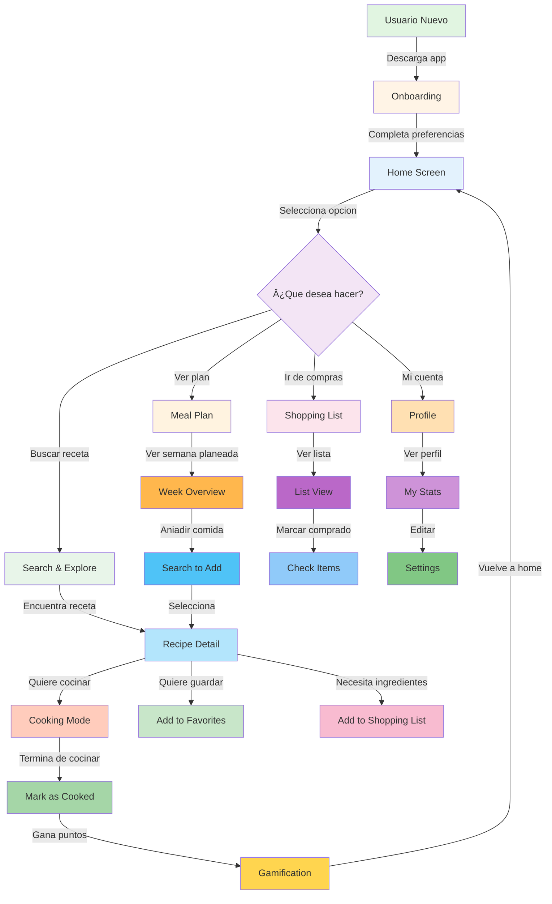

---

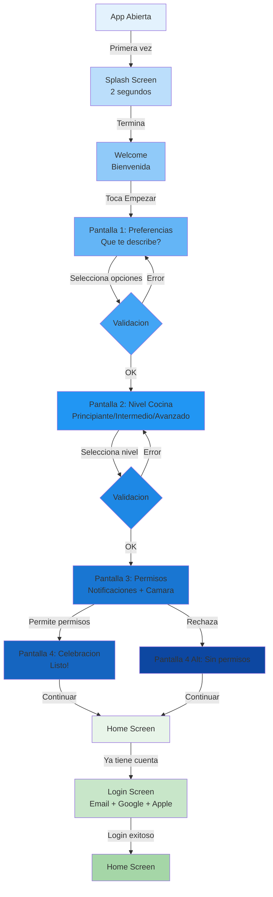

---

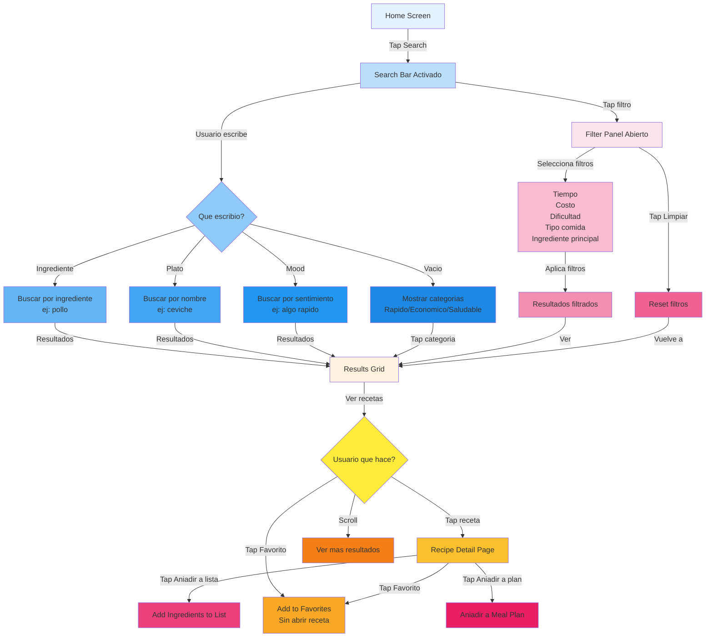

---

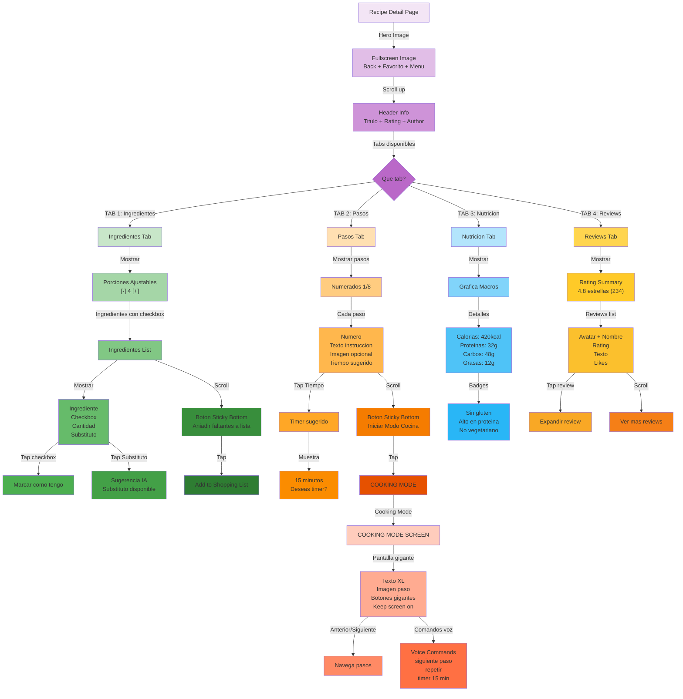

---

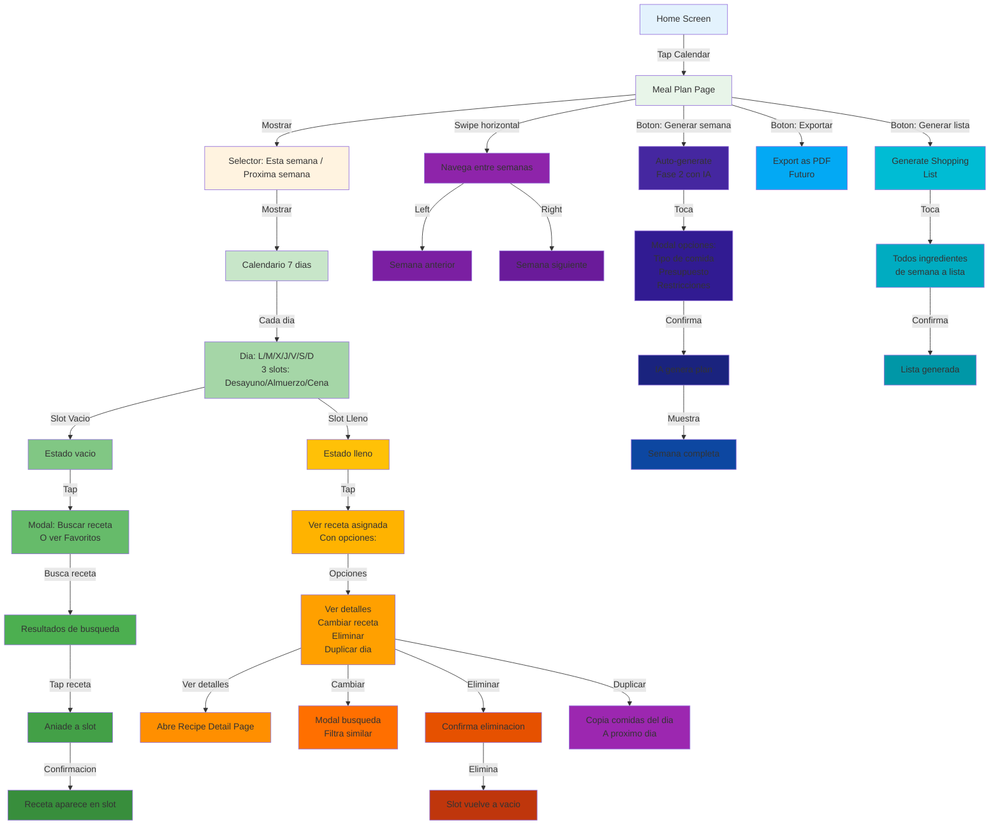

---

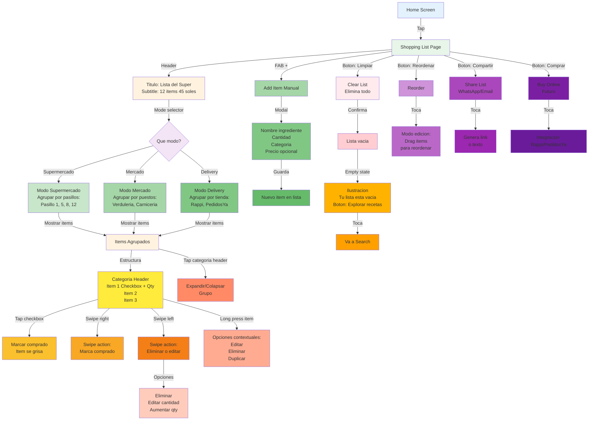

---

```mermaid
graph TD
    A["Recipe Detail - Pasos Tab"] -->|Tap Boton| B["Iniciar Modo Cocina"]
    B -->|Transicion| C["COOKING MODE ACTIVADO"]
    
    C -->|Configuracion| D["Pantalla NO se apaga<br/>Brightness maximo<br/>Orientacion vertical lock"]
    
    C -->|Layout| E["Paso X de Y<br/>@top"]
    E -->|Instruccion| F["TEXTO GIGANTE<br/>40-48px<br/>Line spacing 1.8"]
    F -->|Imagen paso| G["Referencia visual<br/>Altura reducida<br/>Aspect ratio 16:9"]
    G -->|Tiempo| H["~15 minutos"]
    
    H -->|Botones grandes| I["ANTERIOR<br/>SIGUIENTE"]
    I -->|Acciones| J["VOZ: siguiente paso<br/>VOZ: repetir paso<br/>VOZ: ir atras"]
    
    J -->|Voice recognition| K["Usuario dijo?"]
    K -->|siguiente| L["Avanza paso"]
    K -->|repetir| M["Relee paso actual"]
    K -->|atras| N["Paso anterior"]
    K -->|timer 15| O["Inicia timer 15min"]
    K -->|pausar| P["Pausa timer"]
    K -->|ingredientes| Q["Lista ingredientes paso"]
    K -->|tips| R["Muestra tips si existen"]
    
    L -->|Avanzar| S["Muestra siguiente paso"]
    M -->|Relee| T["Text-to-speech paso"]
    
    O -->|Timer activo| U["TIMER VISUAL<br/>15:00 > 14:59..."]
    U -->|Tiempo pasa| V["Color cambia:<br/>Verde > Amarillo > Rojo"]
    V -->|0 segundos| W["NOTIFICACION<br/>Tiempo terminado!"]
    W -->|Vibracion| X["Haptic feedback"]
    
    X -->|Usuario puede| Y["OK Continuar<br/>+5 Aniadir 5min mas"]
    
    H -->|Tap Tiempo| Z["Timer modal:<br/>Slider 1-60min"]
    Z -->|Selecciona| AA["Auto-set timer"]
    
    R -->|Tips contextuales| AB["Tip aparece flotante:<br/>Temperatura media-baja"]
    
    U -->|Back button| AC["Confirmacion:<br/>Salir modo cocina?"]
    AC -->|Confirma| AD["Vuelve a Recipe Detail<br/>Timer en background"]
    
    W -->|Notificacion push| AE["Mientras app cerrada"]
    AE -->|Tap notificacion| AF["Abre Recipe Detail"]
    
    style A fill:#f3e5f5
    style B fill:#e1bee7
    style C fill:#ffccbc
    style D fill:#ffab91
    style E fill:#ff8a65
    style F fill:#ff7043
    style G fill:#ff5722
    style H fill:#ffd54f
    style I fill:#ffca28
    style J fill:#fbc02d
    style K fill:#f9a825
    style L fill:#f57f17
    style M fill:#c8e6c9
    style N fill:#a5d6a7
    style O fill:#81c784
    style P fill:#66bb6a
    style Q fill:#4caf50
    style R fill:#43a047
    style S fill:#388e3c
    style T fill:#2e7d32
    style U fill:#ffd54f
    style V fill:#ffb74d
    style W fill:#ff6f00
    style X fill:#e65100
    style Y fill:#bf360c
    style Z fill:#b3e5fc
    style AA fill:#81d4fa
    style AB fill:#a1887f
    style AC fill:#6d4c41
    style AD fill:#5d4037
    style AE fill:#4e342e
    style AF fill:#3e2723
```

---

```mermaid
graph TD
    A["Home Screen"] -->|Tap Profile| B["Profile Page"]
    
    B -->|Header| C["Avatar<br/>Nombre usuario<br/>Email"]
    C -->|Edit| D["Edit Profile<br/>Modal"]
    D -->|Puede cambiar| E["Avatar<br/>Nombre<br/>Mostrar publico?"]
    
    B -->|Stats Section| F["Mis Estadisticas"]
    F -->|Mostrar| G["Esta Semana:<br/>5 comidas cocinadas<br/>3 nuevas recetas<br/>120 soles ahorrados"]
    
    G -->|Historico| H["Historial:<br/>Ultimos 30 dias"]
    
    B -->|Mis Favoritos| I["Mis Favoritos<br/>X recetas guardadas"]
    I -->|Tap| J["Grid de favoritos"]
    
    B -->|Mis Recetas| K["Mis Recetas<br/>Futuro v2.0"]
    K -->|Recetas usuario| L["Recetas subidas"]
    
    B -->|Preferencias| M["Preferencias"]
    M -->|Tap| N["Settings Modal"]
    
    N -->|Opciones| O["Restricciones Dieteticas<br/>Alergias/Intolerancias<br/>Nivel de Cocina"]
    
    O -->|Guardar| P["Actualiza perfil"]
    
    B -->|Soporte| Q["Soporte/Contacto"]
    Q -->|Tap| R["Enviar email<br/>Ver FAQ"]
    
    B -->|Legal| S["Legal"]
    S -->|Opciones| T["Terms & Conditions<br/>Privacy Policy<br/>Version app"]
    
    B -->|Acciones peligrosas| U["Zona roja"]
    U -->|Opciones| V["Cambiar contraseña<br/>Logout<br/>Eliminar cuenta"]
    
    V -->|Cambiar contraseña| W["Modal:<br/>Contraseña actual<br/>Nueva contraseña"]
    
    V -->|Logout| X["Confirmacion:<br/>Salir de sesion?"]
    X -->|Confirma| Y["Login Screen"]
    
    V -->|Eliminar| Z["Confirmacion final:<br/>Accion IRREVERSIBLE"]
    Z -->|Confirma + Contraseña| AA["Cuenta eliminada<br/>Vuelve a Login"]
    
    style A fill:#e3f2fd
    style B fill:#e8f5e9
    style C fill:#c8e6c9
    style D fill:#a5d6a7
    style E fill:#81c784
    style F fill:#fff3e0
    style G fill:#ffeb3b
    style H fill:#fbc02d
    style I fill:#f9a825
    style J fill:#f57f17
    style K fill:#ffc107
    style L fill:#ffb300
    style M fill:#ce93d8
    style N fill:#ba68c8
    style O fill:#ab47bc
    style P fill:#9c27b0
    style Q fill:#8e24aa
    style R fill:#7b1fa2
    style S fill:#6a1b9a
    style T fill:#4527a0
    style U fill:#ffebee
    style V fill:#ffcdd2
    style W fill:#ef9a9a
    style X fill:#e57373
    style Y fill:#ef5350
    style Z fill:#f44336
    style AA fill:#e53935
```

---

```mermaid
graph TD
    A["Login Screen"] -->|Opciones| B{Como ingresa?}
    
    B -->|Email + Contraseña| C["Form: Email<br/>Password<br/>Remember me"]
    B -->|Google OAuth| D["Google OAuth Flow"]
    B -->|Apple| E["Apple Sign-in Flow"]
    B -->|No tengo cuenta| F["Sign Up"]
    
    C -->|Ingresa datos| G["Validacion:<br/>Email valido?<br/>Password > 6 chars?"]
    G -->|Error| H["Error message"]
    H -->|Corrige| G
    G -->|OK| I["API: POST login"]
    
    D -->|Google aprueba| J["Google OAuth token"]
    J -->|Envia token| K["API: POST auth/google"]
    
    E -->|Apple aprueba| L["Apple token"]
    L -->|Envia token| M["API: POST auth/apple"]
    
    I -->|Response OK| N["Login exitoso<br/>Store token"]
    K -->|Response OK| N
    M -->|Response OK| N
    
    I -->|Response error| O["Credenciales invalidas"]
    O -->|Show| P["Error message<br/>Link: Olvide contraseña"]
    P -->|Reintentar| C
    
    F -->|Sign Up| Q["Form: Email<br/>Password<br/>Confirm password<br/>Nombre"]
    Q -->|Ingresa datos| R["Validacion:<br/>Email valido?<br/>Password > 8 chars?"]
    R -->|Error| S["Show error"]
    S -->|Corrige| R
    R -->|OK| T["API: POST signup"]
    
    T -->|Response OK| U["Cuenta creada<br/>Envia email verificacion"]
    T -->|Response error| V["Email ya existe"]
    V -->|Show| W["Error: Email en uso"]
    W -->|Tapa| C
    
    U -->|Email enviado| X["Modal:<br/>Revisa tu email"]
    X -->|Usuario abre email| Y["Link de verificacion"]
    Y -->|Tap link| Z["Cuenta verificada<br/>Auto-login"]
    
    Z -->|Exitoso| AB["Inicia Onboarding"]
    N -->|Exitoso| AC["Va a Home Screen"]
    
    P -->|Forgot password| AD["Reset Password Screen"]
    AD -->|Ingresa email| AE["API: POST forgot-password"]
    AE -->|OK| AF["Email enviado"]
    AF -->|Usuario abre email| AG["Link reset"]
    AG -->|Tap link| AH["Nueva contraseña<br/>Confirmar"]
    AH -->|Ingresa| AI["API: POST reset-password"]
    AI -->|OK| AJ["Contraseña actualizada"]
    AJ -->|Vuelve a| AC
    
    style A fill:#e3f2fd
    style B fill:#fff3e0
    style C fill:#e8f5e9
    style D fill:#f3e5f5
    style E fill:#ffe0b2
    style F fill:#fff9c4
    style G fill:#ffeb3b
    style H fill:#ffca28
    style I fill:#fbc02d
    style J fill:#f9a825
    style K fill:#f57f17
    style L fill:#4fc3f7
    style M fill:#29b6f6
    style N fill:#c8e6c9
    style O fill:#ffcdd2
    style P fill:#ef9a9a
    style Q fill:#e8f5e9
    style R fill:#c8e6c9
    style S fill:#ffebee
    style T fill:#c8e6c9
    style U fill:#a5d6a7
    style V fill:#ef5350
    style W fill:#f44336
    style X fill:#e53935
    style Y fill:#d32f2f
    style Z fill:#81c784
    style AB fill:#66bb6a
    style AC fill:#4caf50
    style AD fill:#b3e5fc
    style AE fill:#81d4fa
    style AF fill:#4fc3f7
    style AG fill:#29b6f6
    style AH fill:#03a9f4
    style AI fill:#039be5
    style AJ fill:#0288d1
```

---

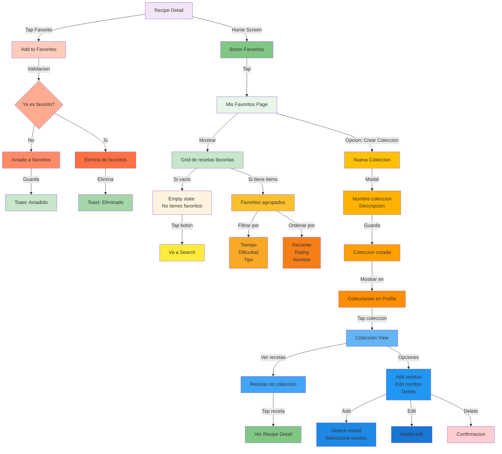

---

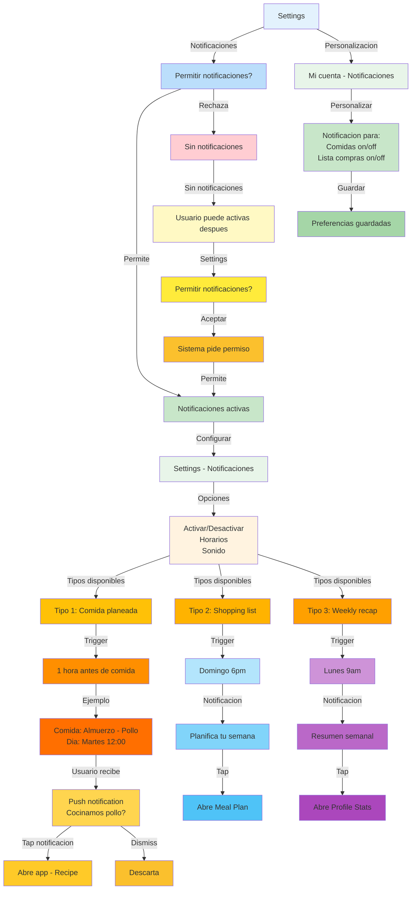

---

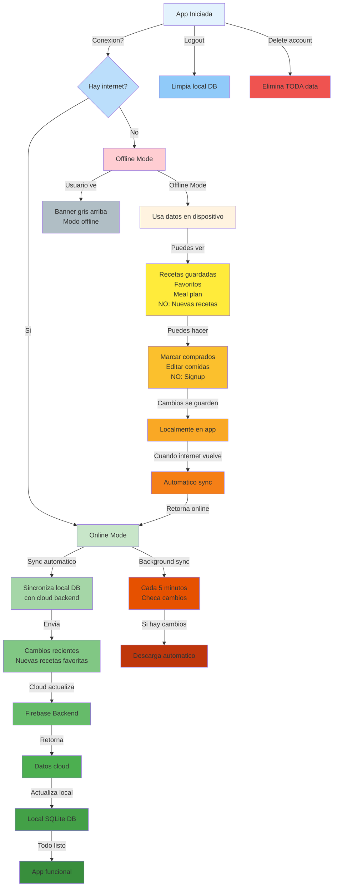

---

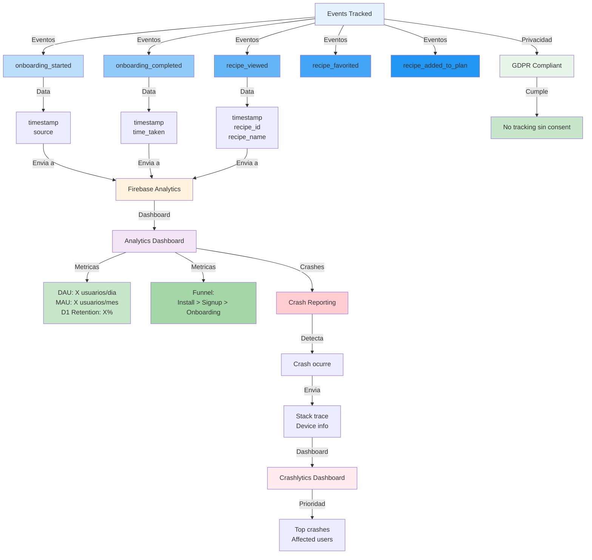

---

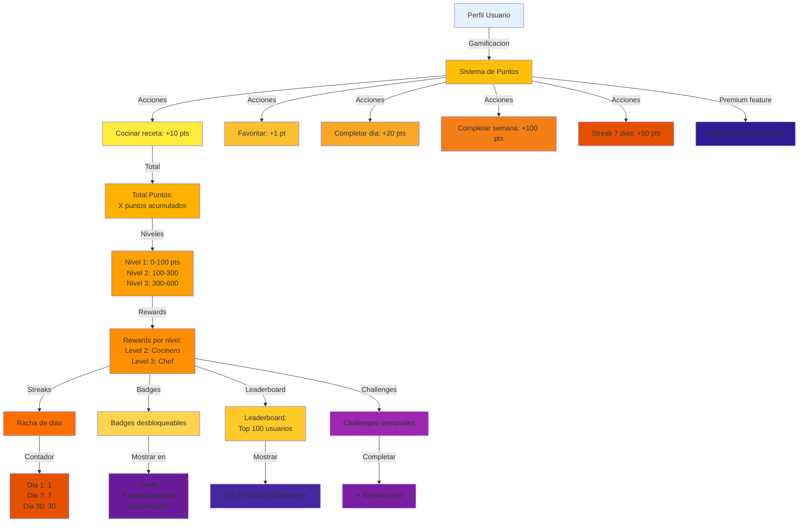

---

```mermaid
graph TD
    A["Settings"] -->|Tema| B["Theme selector"]
    B -->|Opciones| C["Light Mode"]
    B -->|Opciones| D["Dark Mode"]
    B -->|Opciones| E["System Auto"]
    
    C -->|Selecciona| F["Light mode activado"]
    F -->|Background| G["#F9FAFB Gray 50"]
    F -->|Text| H["#111827 Gray 900"]
    F -->|Guarda| I["UserDefaults/SharedPrefs"]
    I -->|App reload| J["Light mode todas pantallas"]
    
    D -->|Selecciona| K["Dark mode activado"]
    K -->|Background| L["#111827 Gray 900"]
    K -->|Text| M["#F9FAFB Gray 50"]
    K -->|Guarda| N["UserDefaults/SharedPrefs"]
    N -->|App reload| O["Dark mode todas pantallas"]
    
    E -->|Selecciona| P["Auto mode activado"]
    P -->|6am-6pm| Q["Light mode automatico"]
    P -->|6pm-6am| R["Dark mode automatico"]
    P -->|Change| S["Detecta cambio sistema"]
    S -->|Automaticamente| T["Cambia app theme"]
    
    J -->|Componentes| U["Colors actualizados<br/>Shadows adaptadas"]
    O -->|Componentes| U
    T -->|Componentes| U
    
    U -->|Home Screen| V["Colors segun tema"]
    U -->|Recipe Detail| W["Colors segun tema"]
    U -->|Lists| X["Colors segun tema"]
    
    style A fill:#e3f2fd
    style B fill:#bbdefb
    style C fill:#fff59d
    style D fill:#424242
    style E fill:#90caf9
    style F fill:#fff9c4
    style G fill:#ffeb3b
    style H fill:#fbc02d
    style I fill:#f9a825
    style K fill:#303030
    style L fill:#424242
    style M fill:#616161
    style N fill:#757575
    style O fill:#9e9e9e
    style P fill:#b0bec5
    style Q fill:#fff3e0
    style R fill:#263238
    style S fill:#455a64
    style T fill:#37474f
    style U fill:#e1f5e1
    style V fill:#c8e6c9
    style W fill:#a5d6a7
    style X fill:#81c784
```