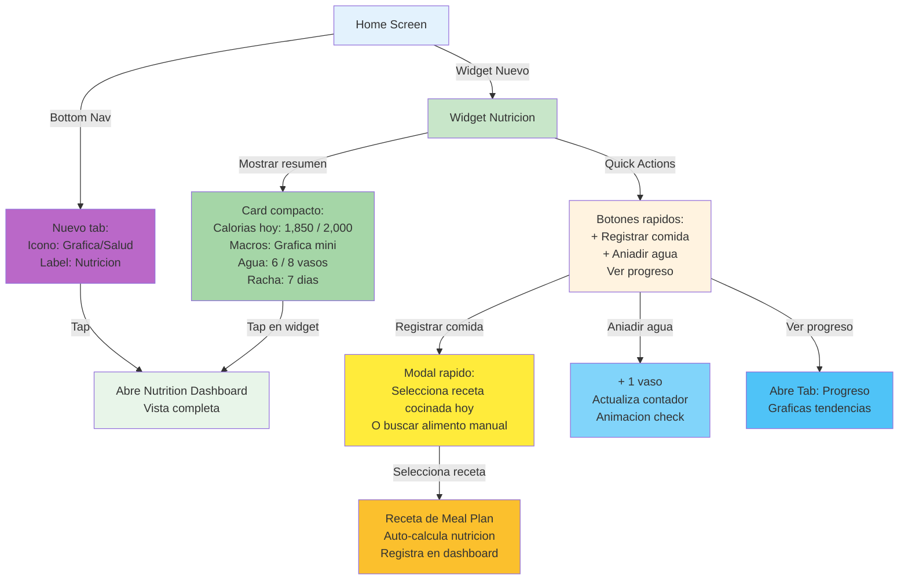
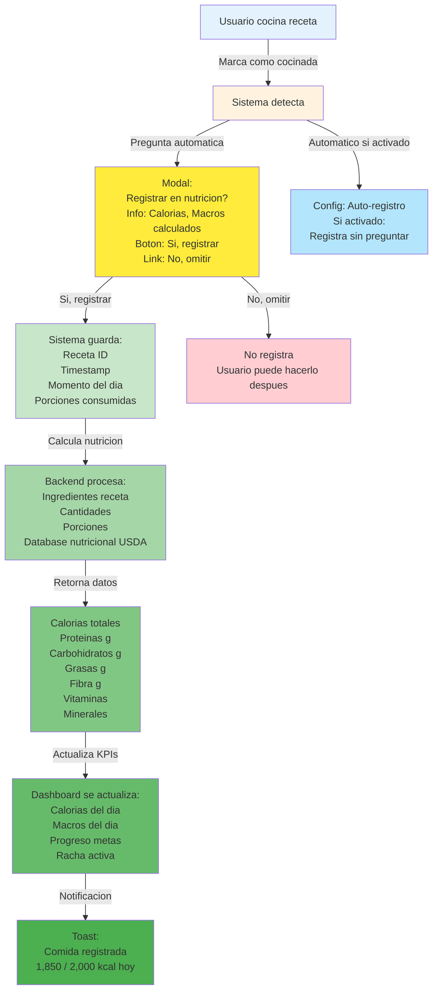
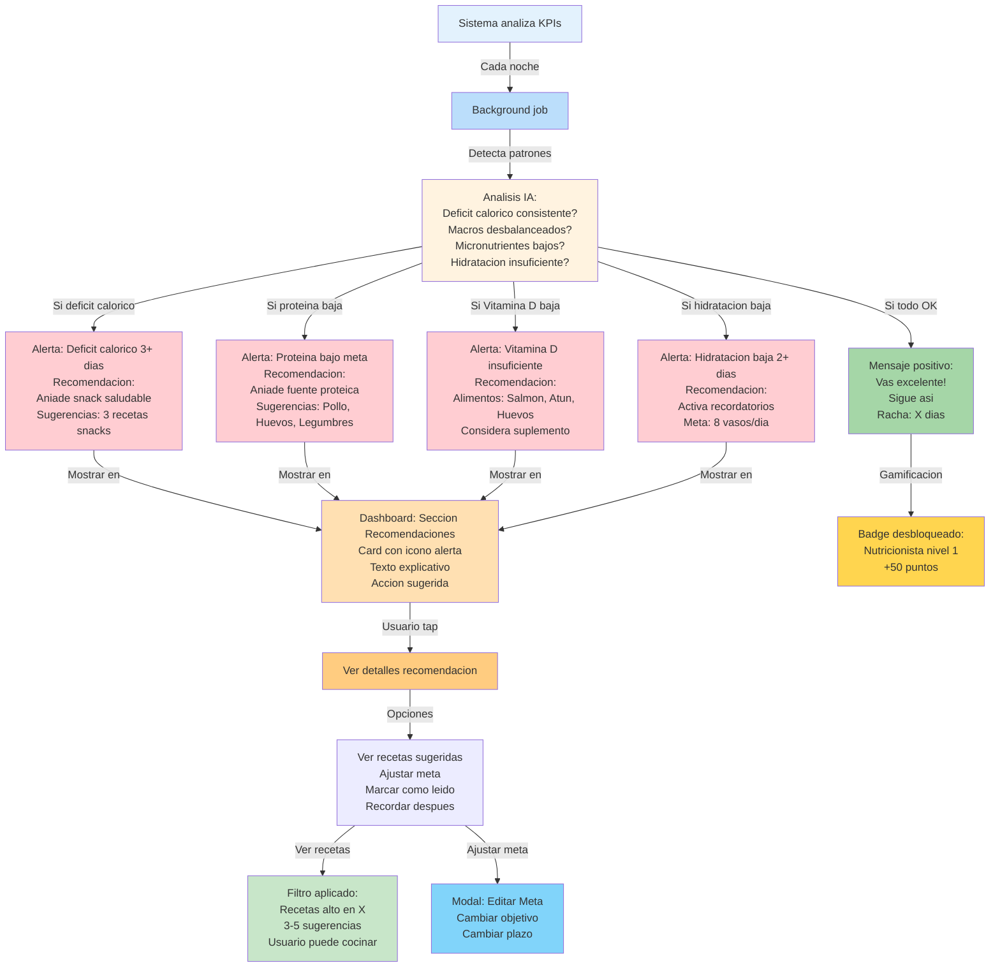
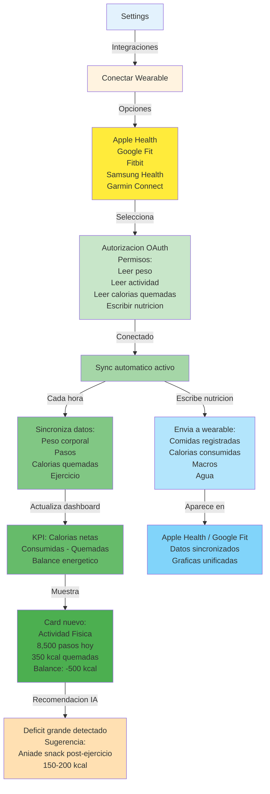

# FLUJO 16: NUTRITION DASHBOARD & HEALTH KPIs

## Flujo Completo: Dashboard Nutricional con KPIs

```mermaid
graph TD
    A["Home Screen"] -->|Tap Widget Nutricion| B["Nutrition Dashboard"]
    A -->|Menu Profile| C["Profile Page"]
    C -->|Tap Mi Nutricion| B
    
    B -->|Header| D["Resumen Semanal<br/>Periodo seleccionable"]
    D -->|Selector periodo| E["Hoy / Esta Semana / Este Mes / Personalizado"]
    
    B -->|KPI Cards| F["Grid de KPIs principales"]
    
    F -->|Card 1| G["Calorias Consumidas<br/>1,850 / 2,000 kcal<br/>Barra progreso: 92%<br/>Grafica tendencia 7 dias"]
    
    F -->|Card 2| H["Macronutrientes<br/>Grafica circular:<br/>Proteinas 30%<br/>Carbohidratos 45%<br/>Grasas 25%"]
    
    F -->|Card 3| I["Agua Consumida<br/>6 / 8 vasos<br/>Botones rapidos:<br/>+ 1 vaso"]
    
    F -->|Card 4| J["Comidas Registradas<br/>3 / 3 comidas hoy<br/>Desayuno - Almuerzo - Cena<br/>Check marks verdes"]
    
    F -->|Card 5| K["Racha Saludable<br/>7 dias consecutivos<br/>Meta: 30 dias<br/>Barra progreso"]
    
    F -->|Card 6| L["Deficit/Superavit<br/>-150 kcal deficit hoy<br/>Color verde si deficit<br/>Rojo si superavit"]
    
    G -->|Tap en Card| M["Detalle Calorias"]
    M -->|Mostrar| N["Grafica semanal/mensual<br/>Linea de meta diaria<br/>Puntos cada dia<br/>Promedio periodo"]
    
    M -->|Desglose| O["Por comida:<br/>Desayuno: 450 kcal<br/>Almuerzo: 800 kcal<br/>Cena: 600 kcal<br/>Snacks: 0 kcal"]
    
    H -->|Tap en Card| P["Detalle Macronutrientes"]
    P -->|Mostrar| Q["Grafica barras apiladas<br/>Ultimos 7 dias<br/>Distribucion diaria"]
    
    P -->|Metas actuales| R["Proteinas: 150g / 160g<br/>Carbohidratos: 225g / 250g<br/>Grasas: 56g / 55g<br/>Barra progreso cada uno"]
    
    P -->|Recomendaciones IA| S["Tip: Necesitas mas proteina<br/>Sugerencia: Aniade pollo o huevos<br/>Recetas sugeridas: 3 cards"]
    
    I -->|Tap en Card| T["Detalle Hidratacion"]
    T -->|Historial| U["Grafica vasos por dia<br/>Ultimos 14 dias<br/>Meta: 8 vasos/dia"]
    
    T -->|Recordatorios| V["Configurar recordatorio<br/>Cada 2 horas<br/>De 8am a 8pm"]
    
    K -->|Tap en Card| W["Detalle Rachas"]
    W -->|Mostrar| X["Calendario con checks<br/>Dias completados: verde<br/>Dias fallados: gris<br/>Dia actual: azul"]
    
    W -->|Logros| Y["Badges desbloqueados:<br/>7 dias - Cocinero<br/>30 dias - Chef<br/>90 dias - Maestro<br/>365 dias - Leyenda"]
    
    B -->|Seccion: Micronutrientes| Z["Vitaminas y Minerales"]
    Z -->|Mostrar| AA["Lista con barras:<br/>Vitamina A: 80%<br/>Vitamina C: 120%<br/>Calcio: 65%<br/>Hierro: 75%<br/>Vitamina D: 45% - Bajo"]
    
    AA -->|Tap nutriente bajo| AB["Alerta: Vitamina D baja<br/>Recomendacion:<br/>Alimentos ricos: Salmon, Huevos<br/>Boton: Ver recetas"]
    
    AB -->|Ver recetas| AC["Recetas filtradas:<br/>Alto en Vitamina D<br/>3-5 recetas sugeridas"]
    
    B -->|Seccion: Metas Personales| AD["Mis Metas Nutricionales"]
    AD -->|Mostrar| AE["Lista metas activas:<br/>Perder 2kg este mes<br/>Comer 5 porciones verduras/dia<br/>Reducir azucar<br/>Aumentar fibra"]
    
    AE -->|Tap meta| AF["Detalle Meta:<br/>Progreso: 60%<br/>Dias restantes: 12<br/>En camino / Atrasado / Adelantado"]
    
    AF -->|Ajustar meta| AG["Modal: Editar Meta<br/>Cambiar valor objetivo<br/>Cambiar plazo<br/>Eliminar meta"]
    
    AD -->|Boton: Nueva Meta| AH["Crear Nueva Meta"]
    AH -->|Opciones| AI["Seleccionar tipo:<br/>Peso corporal<br/>Calorias diarias<br/>Macronutrientes<br/>Hidratacion<br/>Micronutrientes<br/>Personalizada"]
    
    AI -->|Ingresa datos| AJ["Valor actual<br/>Valor objetivo<br/>Plazo dias/semanas<br/>Prioridad Alta/Media/Baja"]
    
    AJ -->|Guardar| AK["Meta creada<br/>Aparece en dashboard<br/>Notificaciones activadas"]
    
    B -->|Boton Flotante| AL["Registrar Comida Manual"]
    AL -->|Modal| AM["Que comiste?<br/>Buscar alimento<br/>O escanear codigo barras<br/>O seleccionar receta app"]
    
    AM -->|Ingresa| AN["Nombre alimento<br/>Porcion/cantidad<br/>Momento: Desayuno/Almuerzo/etc"]
    
    AN -->|Confirma| AO["Nutricion calculada<br/>Actualiza KPIs<br/>Toast: Registrado"]
    
    B -->|Tab: Resumen| AP["Vista actual: Dashboard KPIs"]
    B -->|Tab: Progreso| AQ["Vista: Graficas tendencias"]
    B -->|Tab: Metas| AR["Vista: Metas nutricionales"]
    B -->|Tab: Historial| AS["Vista: Historial comidas"]
    
    AQ -->|Mostrar| AT["Graficas interactivas:<br/>Peso corporal<br/>IMC<br/>Calorias promedio<br/>Macros distribucion<br/>Periodo: 1M / 3M / 6M / 1Y"]
    
    AS -->|Mostrar| AU["Lista cronologica:<br/>Hoy<br/>Ayer<br/>Hace 2 dias<br/>Cada dia expandible"]
    
    AU -->|Tap dia| AV["Detalle comidas del dia:<br/>Desayuno: Receta X<br/>Almuerzo: Receta Y<br/>Cena: Receta Z<br/>Info nutricional total"]
    
    B -->|Boton Exportar| AW["Exportar Reporte"]
    AW -->|Opciones| AX["Formato:<br/>PDF<br/>CSV<br/>Imagen PNG"]
    
    AX -->|Periodo| AY["Seleccionar:<br/>Ultima semana<br/>Ultimo mes<br/>Personalizado"]
    
    AY -->|Generar| AZ["Reporte generado<br/>Compartir via:<br/>Email / WhatsApp / Drive"]
    
    B -->|Configuracion| BA["Settings Nutricion"]
    BA -->|Opciones| BB["Metas diarias calorias<br/>Distribucion macros<br/>Unidades medida kg/lb<br/>Recordatorios activos<br/>Integraciones: Apple Health/Google Fit"]
    
    BB -->|Guardar| BC["Preferencias actualizadas<br/>Recalcula metas<br/>Actualiza dashboard"]
    
    style A fill:#e3f2fd
    style B fill:#e8f5e9
    style F fill:#fff3e0
    style G fill:#c8e6c9
    style H fill:#a5d6a7
    style I fill:#81c784
    style J fill:#66bb6a
    style K fill:#4caf50
    style L fill:#43a047
    style M fill:#ffe0b2
    style P fill:#ffcc80
    style S fill:#ffd54f
    style T fill:#b3e5fc
    style W fill:#81d4fa
    style Z fill:#f8bbd0
    style AA fill:#f48fb1
    style AD fill:#ce93d8
    style AE fill:#ba68c8
    style AH fill:#ab47bc
    style AL fill:#9c27b0
    style AQ fill:#7986cb
    style AS fill:#5c6bc0
    style AW fill:#3f51b5
    style BA fill:#ffb74d
```

---

## INTEGRACION EN HOME SCREEN

---

## AUTOMATIZACION: CALCULO NUTRICIONAL DE RECETAS

---

## RECOMENDACIONES IA BASADAS EN KPIs

---

## INTEGRACION CON WEARABLES (FUTURO v2.0)

---

## RESUMEN DE FEATURES KPIs NUTRICIONALES

### PANTALLA PRINCIPAL: Nutrition Dashboard

**Seccion 1: KPIs Principales (Cards)**
- Calorias Consumidas vs Meta
- Macronutrientes (Grafica circular)
- Hidratacion (vasos agua)
- Comidas Registradas hoy
- Racha Dias Saludables
- Deficit/Superavit Calorico

**Seccion 2: Micronutrientes**
- Vitaminas A, C, D, E, K
- Minerales: Calcio, Hierro, Potasio, Magnesio
- Barras de progreso
- Alertas si bajo

**Seccion 3: Metas Personales**
- Lista metas activas
- Progreso cada meta
- Crear nueva meta
- Editar/Eliminar metas

**Seccion 4: Recomendaciones IA**
- Sugerencias basadas en datos
- Recetas filtradas
- Tips nutricionales

### TABS:
1. **Resumen** - Dashboard principal KPIs
2. **Progreso** - Graficas tendencias temporales
3. **Metas** - Gestion metas nutricionales
4. **Historial** - Comidas registradas por dia

### ACCIONES RAPIDAS:
- Registrar comida manual
- Aniadir vaso agua (+ 1)
- Exportar reporte PDF/CSV
- Configurar recordatorios

### AUTOMATIZACION:
- Al cocinar receta → Pregunta si registrar
- Calculo automatico nutricion de recetas
- Sync con wearables (Apple Health, Google Fit)
- Analisis nocturno IA → Recomendaciones

### GAMIFICACION:
- Rachas dias consecutivos
- Badges nutricionales
- Puntos por cumplir metas
- Leaderboard salud (opcional)

---

## UBICACION EN LA APP

### Home Screen:
- **Widget Nutricion** (card compacto)
- Quick actions: + Comida, + Agua

### Bottom Navigation:
- **Nuevo tab: "Nutricion"** o "Salud"
- Icono: Grafica o Corazon
- Acceso directo a Dashboard

### Profile:
- Link: "Mi Nutricion"
- Link: "Mis Metas"
- Link: "Integraciones Salud"

---

## MVP vs FUTURO

### MVP (v1.0):
- KPIs basicos (calorias, macros, agua)
- Registro manual comidas
- Metas simples (peso, calorias)
- Dashboard con 6 KPIs principales

### v1.2:
- Micronutrientes
- Graficas tendencias
- Exportar reportes
- Recordatorios hidratacion

### v2.0:
- Recomendaciones IA avanzadas
- Integracion wearables
- Gamificacion nutricional
- Analisis predictivo

---

Listo! Este es el flujo completo de KPIs nutricionales y dashboard de salud que faltaba.